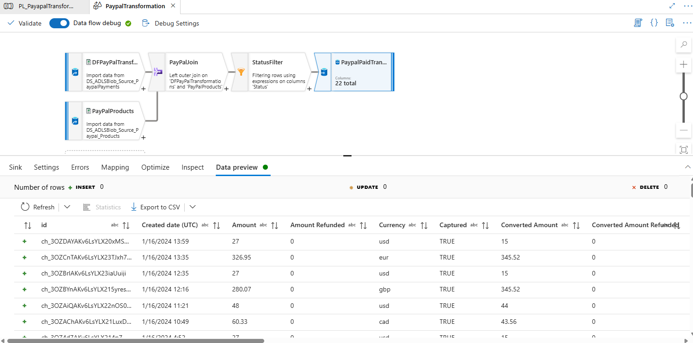
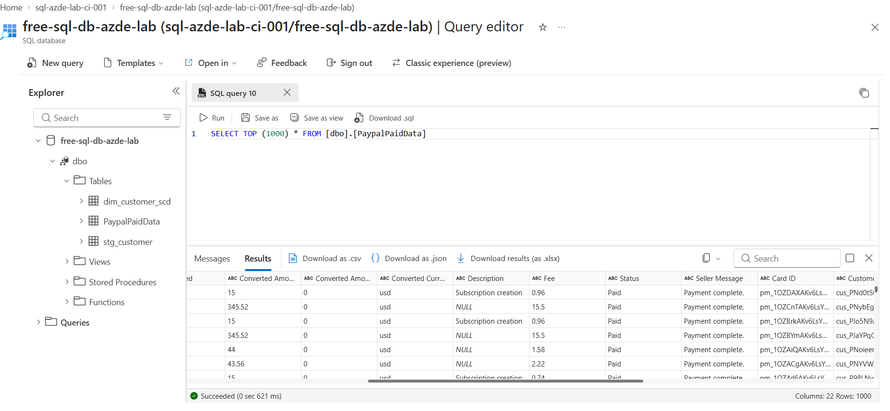
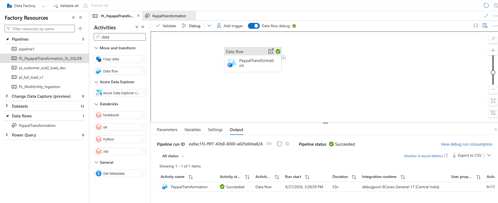

# 💳 PayPal Transaction Ingestion & Transformation Engine

An end-to-end data transformation pipeline built in **Azure Data Factory (ADF)** using **Mapping Data Flows** (Spark compute) to join distributed payments and product catalogs from ADLS Gen2, filter settled payments, and persist curated rows to an Azure SQL Database.

---

## 🏗️ Architecture & Lineage

```text
[ ADLS Gen2: DS_ADLSBlob_Source_PaypalPayments ]  ──┐
                                                    ├──► [ Left Outer Join ] ──► [ Filter: Status == 'Paid' ] ──► [ Azure SQL Sink ]
[ ADLS Gen2: DS_ADLSBlob_Source_Paypal_Products ]  ──┘       (PayPalJoin)             (StatusFilter)             (dbo.PaypalPaidTransactions)
```

### Components
* **Pipeline Orchestrator:** `PL_PayapalTransformation_To_SQLDB`
* **Transformation Compute:** Azure Integration Runtime (8-Cores General Compute Data Flow cluster)
* **Sources:**
  * `DS_ADLSBlob_Source_PaypalPayments` (CSV)
  * `DS_ADLSBlob_Source_Paypal_Products` (CSV)
* **Sink:** Azure SQL Database (`dbo.PaypalPaidTransactions`, 22 mapped target attributes)

---

## 🔄 Transformation Logic

1. **Multi-Source Read:** Ingests raw transactional event files and product reference metadata from ADLS Gen2 object storage.
2. **Left Outer Join (`PayPalJoin`):** Joins transactions with product reference attributes on primary matching keys while preserving unmatched parent records.
3. **Filter Transformation (`StatusFilter`):** Applies predicate logic `Status == 'Paid'` to prune pending, failed, or disputed transactions prior to relational write.
4. **Relational Sink (`PaypalPaidTransactions`):** Maps 22 strongly typed columns into Azure SQL DB.

---

## 📊 Pipeline Run & Data Preview Verification

### 1. Data Flow Transformation Graph


### 2. Output Data Preview (Filtered `Status = Paid`)


### 3. Pipeline Debug Execution


---

## 🗄️ SQL Sink DDL

```sql
CREATE TABLE dbo.PaypalPaidTransactions (
    ConvertedAmountRefunded DECIMAL(10,2),
    ConvertedCurrency       VARCHAR(10),
    Description             VARCHAR(255),
    Fee                     DECIMAL(10,2),
    Status                  VARCHAR(50),
    SellerMessage           VARCHAR(255),
    CardID                  VARCHAR(100),
    CustomerID              VARCHAR(100),
    InvoiceID               VARCHAR(100),
    InsertedAt              DATETIME DEFAULT GETDATE()
);
```
