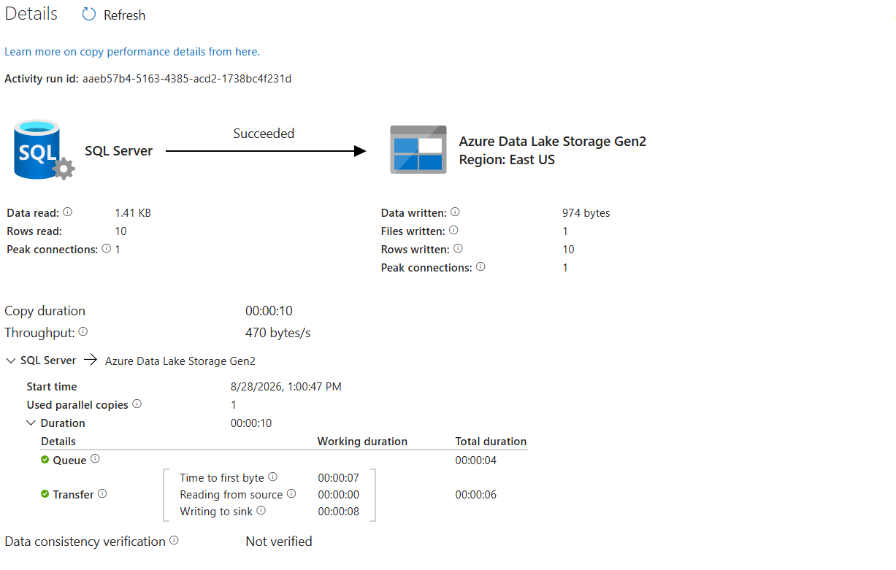
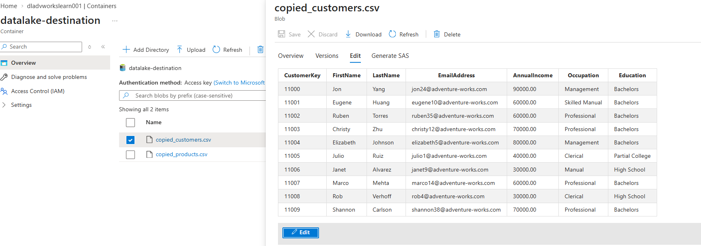
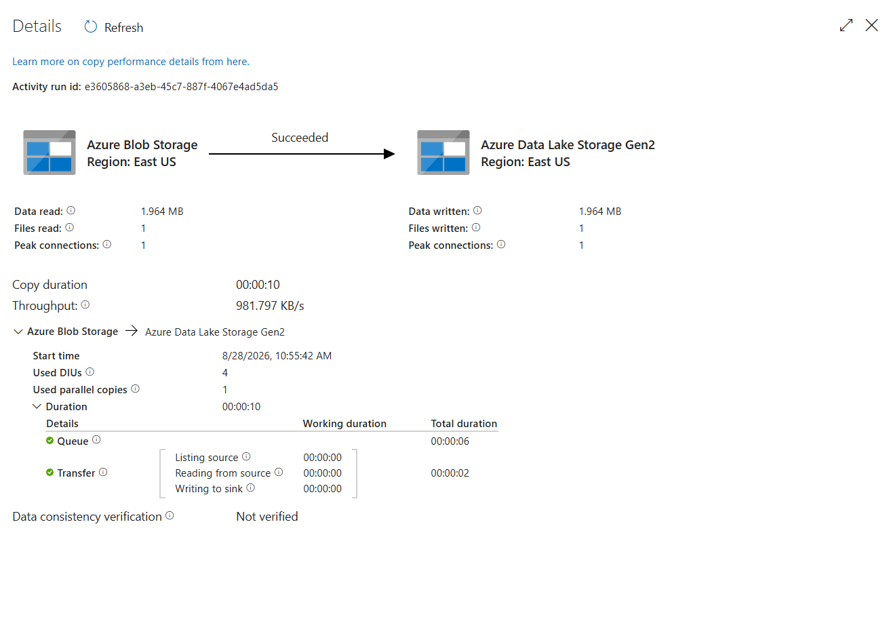
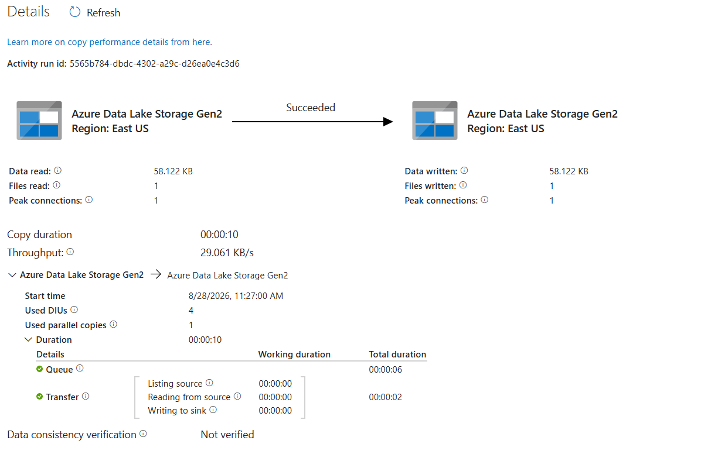

# Copy Data Pipeline in Azure Data Factory

Hands-on practice with the **Copy Data pipeline in Azure Data Factory (ADF)**, focusing on moving data between different sources and Azure storage destinations.

## 🎯 Objective

Understand how ADF's **Copy Activity** can be used to build data movement pipelines between SQL Server, Azure Blob Storage and ADLS Gen2.

## 🔄 Pipelines Practiced

| # | Source | Destination |
|---|---|---|
| 01 | SQL Server | ADLS Gen2 |
| 02 | On-Premises SQL Server | ADLS Gen2 |
| 03 | Azure Blob Storage | ADLS Gen2 |
| 04 | ADLS Gen2 | ADLS Gen2 |

## 🛠️ Concepts Practiced

- Azure Data Factory Pipelines
- Copy Activity
- Source & Sink configuration
- Linked Services
- Datasets
- Integration Runtime
- SQL Server connectivity
- Azure Blob Storage
- ADLS Gen2
- Data movement
- Pipeline execution
- Monitoring and execution metrics

## 📸 Hands-on Execution

### 01 — SQL Server → ADLS Gen2



### 02 — On-Premises SQL Server → ADLS Gen2



### 03 — Azure Blob Storage → ADLS Gen2



### 04 — ADLS Gen2 → ADLS Gen2



## 🧠 Key Takeaway

This exercise helped me understand how **Azure Data Factory orchestrates data movement using Copy Activity**, and how different sources and destinations are connected through Linked Services, Datasets and Integration Runtime.

The practical focus was on understanding the complete flow:

```text
Source
  ↓
Linked Service
  ↓
Dataset
  ↓
Copy Activity
  ↓
Pipeline
  ↓
Sink
  ↓
Execution & Monitoring
